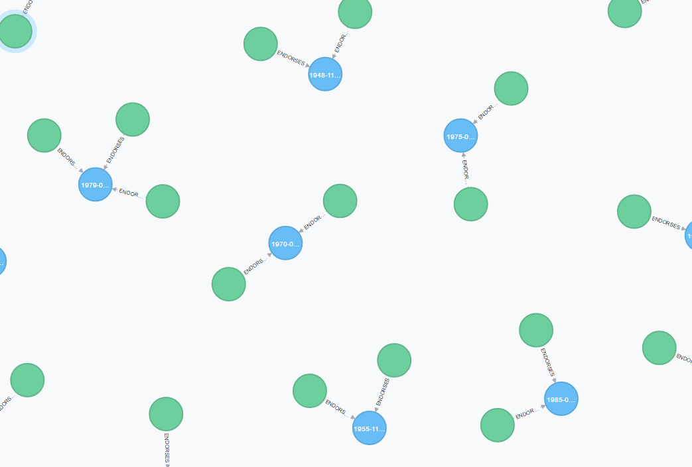

## SQL

| Depth        | Total time           | Median  |
| ------------- |-------------| -----:|
| #0      | 0.5850000000000002ms | 0.02925000000000001ms |
| #1      | 0.22200000000000006ms      |   0.011100000000000002ms |
| #2 | 0.18900000000000006ms      |    0.009450000000000004ms |
| #3 | 0.18600000000000005ms|  0.009300000000000003ms |
| #4 |  0.191ms | 0.00955ms |

I had to create a index on `targetId` otherwise it would take too long time for depth #1.

## NEO4J
After a lot of try I was not able to get it working. My first problems was that I was not able to connect, after I made local DB instead, I had trouble getting the data into the DB. After I got that working I was able to search for persons and endorsement, by I was not able to get the "endorses" working (all queries returned 0 records)

I tried some the queries that the other groups had made, but that did not work either..

See the picture for that the data is in Neo



For creating the relationship I did

```
MATCH (p:Endorsement),(s:Person)
WHERE p.target_node_id = s.node_id
CREATE (s)-[:ENDORSES]->(p)
```

And for reading I did

```
MATCH (a:Person {node_id: "174" })-[b:Muhaha*1]->(c:Person)
RETURN c
```

If I do
```
MATCH (a:Person {node_id: "174" })
RETURN a
```

I am able to find the person.